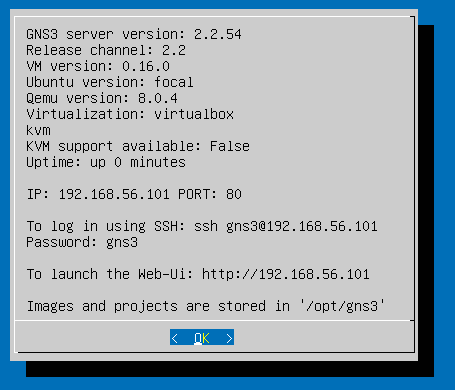
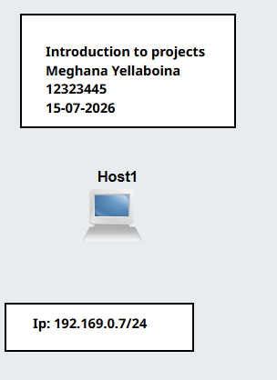
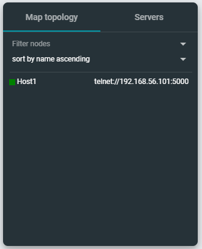
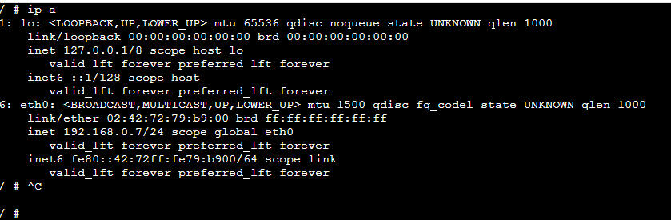

***********************************************************************************
### COIT20261: Network Services and Automation

# Week 1 | Introduction to Internetworking
 ***********************************************************************************
 
## Tutorial Activities

## Task 1: Introduction to GNS3 Basics

GNS3 is not separate software, it is a virtual computer that operates on VirtualBox. There are supplied files provided in onedrive are used to install it.  
An IP address will appear once the VirtualBox machine has been started.  
To access the GNS3 interface and start a new project, you need to input this IP address into a web browser. 

 
 

Click "Add Blank Project" and enter a suitable project name to start a new project.  
Next, add a Linux host (shown by a computer icon) and fill in a text field with information such the host name, IP address, title, and date. 

 
 

Configure the host settings after that. By deleting the comment box and making the necessary adjustments, the IP address can be modified.  
Every host that is added to the project should go through the same configuration procedure. 

 
 

Run the project once the configuration is complete.  
To view a host's IP address, right-click on it and choose the command option. 

 
 

The above is the Tutorial-1 class. In this class, we learned how to set up GNS3 with VirtualBox, create a project, add Linux hosts, configure IP addresses, and run a basic network simulation. This completes the first tutorial class.
