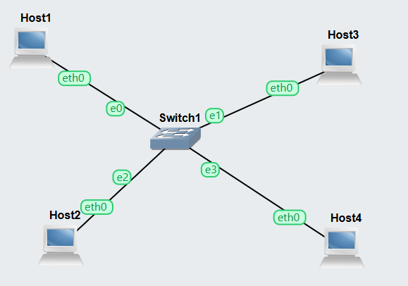
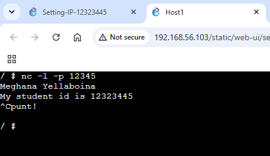
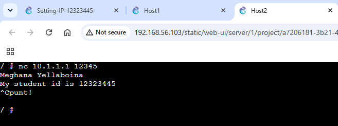
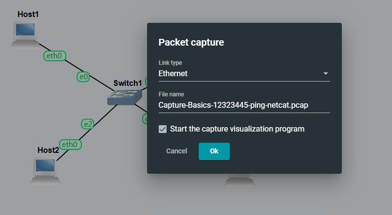
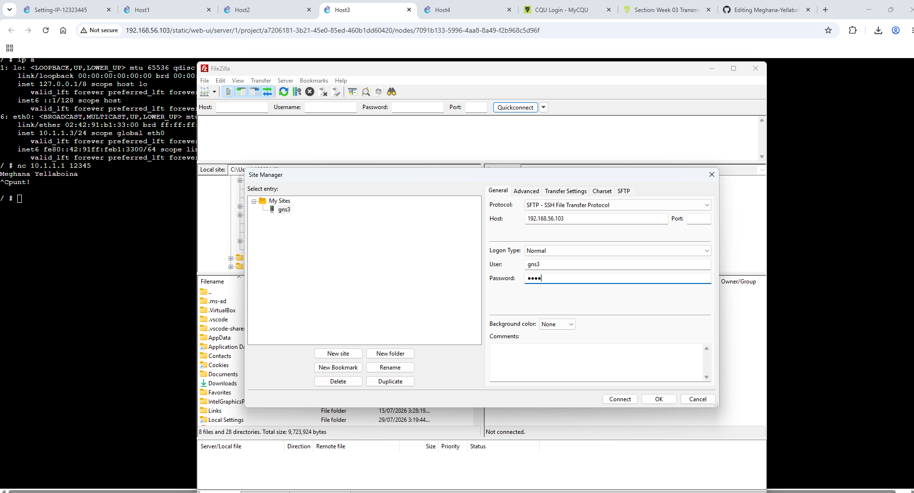
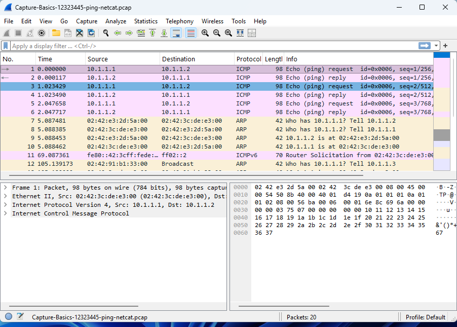

ip addr add 10.1.0.1/24 dev eth0
ip a 

[Setting IP Addresses Project](./Setting-IP-12323445.gns3project)

[Captured Packets](./Capture-Basics-12323445-ping-netcat.pcap)

Netcat-Basics-<studentid>-client-server.png
Capture-Basics-<studentid>-ping-netcat.pcap

