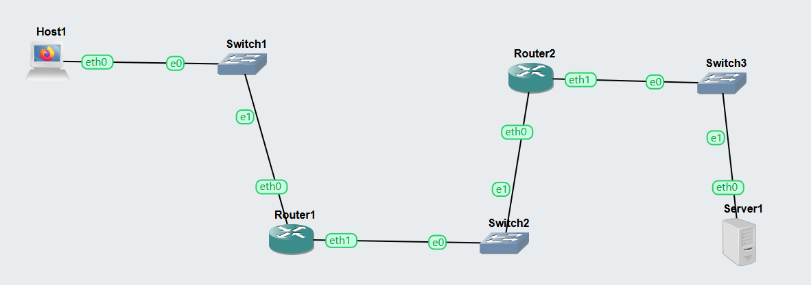
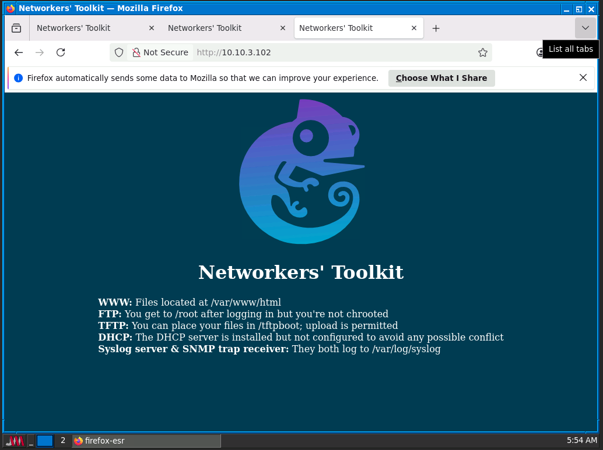
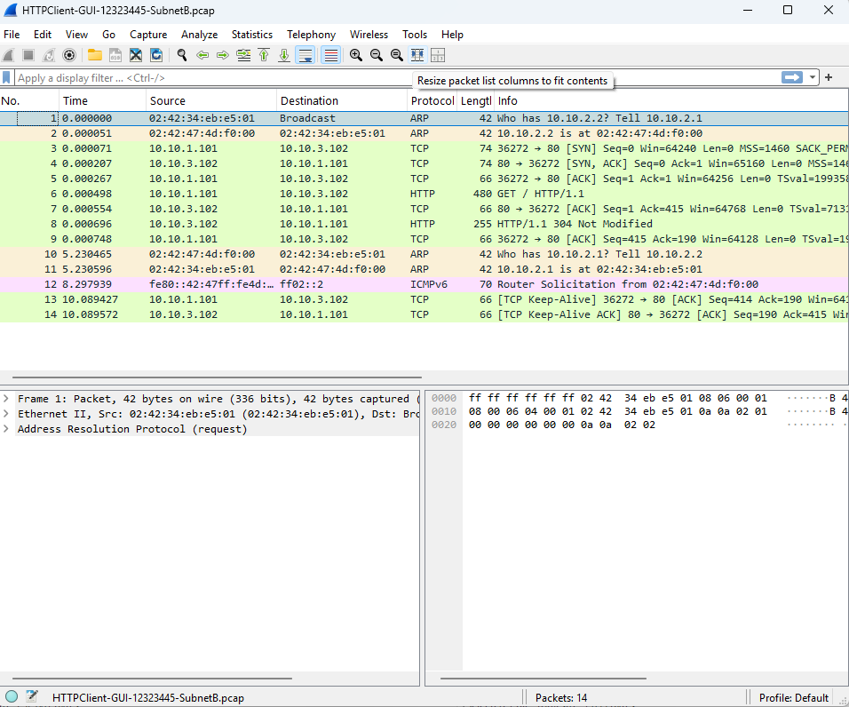
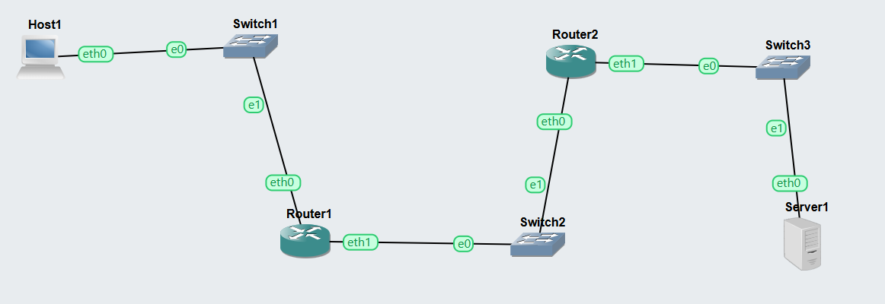
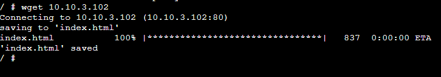
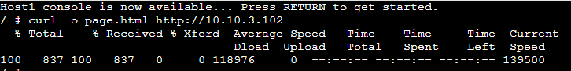
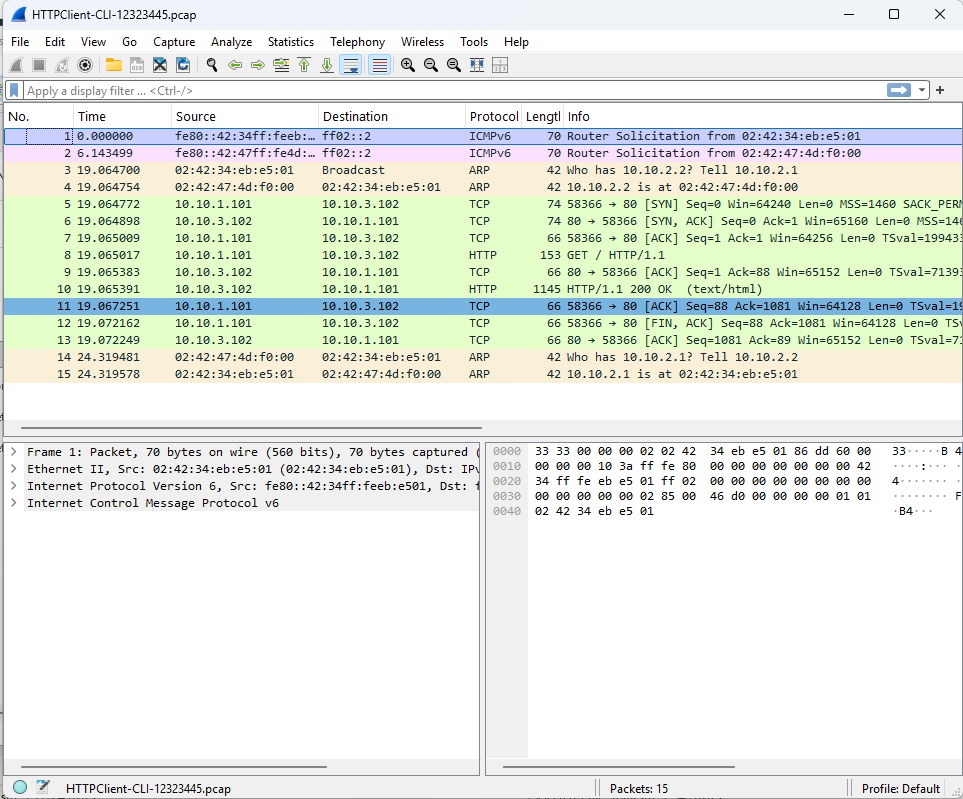

***********************************************************************************
### COIT20261: Network Services and Automation

# Week 4 | Classful & classless Addressing
 ***********************************************************************************
 
## Tutorial Activities

[HTTPClient-GUI-12323445-project](./HTTPClient-GUI-12323445.gns3project)

[HTTPClient-CLI-12323445-project](./HTTPClient-CLI-12323445.gns3project)

## Task 1: HTTP Client using GUI
The objective of this task was to access a web server using a graphical web browser and capture the generated HTTP traffic between the routers.
Network Topology

The network was divided into three subnets.

Subnet A
Firefox Host
Switch1
Subnet B
Router1
Router2
Switch2
Subnet C
Linux Server
Switch3

Router1 connected Subnet A and B.

Router2 connected Subnet B and C.

The Firefox Host was accessed using the built-in VNC client provided by GNS3.

Firefox was opened and the following URL was entered:

http://10.10.3.102

The webpage successfully displayed the default Networkers' Toolkit page hosted by the Linux Server.

Packet capture was started on the Ethernet link between Router1 and Router2 located in Subnet B.

This location captures all HTTP traffic travelling between the client and server.
The packet capture file was opened in Wireshark.

The capture contained:

ARP packets
TCP Three-Way Handshake
HTTP GET Request
HTTP Response
ACK packets

The successful HTTP communication confirmed that the browser successfully retrieved the webpage from the Linux Server.

[HTTPClient-GUI-12323445-SubnetB-Captured Packets](./HTTPClient-GUI-12323445-SubnetB.pcap)

The Firefox browser successfully communicated with the remote web server over HTTP. The captured packets showed the TCP connection establishment followed by HTTP requests and responses between the client and server.

## Task 2: HTTP Client using Command Line
The purpose of this task was to access the same web server using Linux command-line HTTP clients (wget and curl) and compare their behaviour with a graphical browser.

Network Configuration

The Firefox Host was replaced with a Linux Host while maintaining the same IP configuration.

The remainder of the network remained unchanged.

Using wget

The following command was executed:

wget http://10.10.3.102

The webpage was successfully downloaded and saved locally as:

index.html

The terminal displayed the download progress, confirming successful communication with the HTTP server.

Using curl

The following command was executed:

curl -o page.html http://10.10.3.102

The webpage was downloaded and stored as:

page.html

The terminal displayed transfer statistics including download percentage, transfer speed, and total bytes received.

Packet Capture

Packet capture was again started on the Router1–Router2 link while the wget command was executed.
The captured packets verified that both wget and curl successfully communicated with the web server.
[HTTPClient-CLI-12323445-Captured Packets](./HTTPClient-CLI-12323445.pcap)

**********************************************************************************************************************
### Self Reflection
**************************************************************************************************************************
During Week 4, I developed a stronger understanding of HTTP communication by using both graphical and command-line HTTP clients. Accessing the web server through Firefox helped me understand how browsers communicate with web servers, while using wget and curl demonstrated how HTTP requests can be automated without a graphical interface. Comparing these approaches showed that command-line tools are lightweight, efficient, and well suited for scripting and network administration tasks.

Capturing traffic between the routers and analysing it in Wireshark improved my ability to identify the sequence of ARP, TCP, and HTTP packets exchanged during web communication. Observing the TCP handshake, HTTP GET requests, and server responses gave me practical insight into how web applications operate over a network. Overall, this tutorial strengthened my confidence in configuring multi-subnet networks, using different HTTP clients, capturing network traffic, and interpreting protocol behaviour through packet analysis. These skills are valuable for future networking, system administration, and cybersecurity tasks.

**************************************************************************************************************************
