***********************************************************************************
### COIT20261: Network Services and Automation

# Week 5 | Routing

***********************************************************************************

## Tutorial Activities

## Task 1: View Routing Tables

[View-Routes-12323445 Project](./View-Routes-12323445.gns3project)

### Objective

The objective of this task was to understand how routing tables are used to forward packets between different IPv4 subnets and how IP forwarding allows a Linux Router to operate as a gateway between networks.

Task-1
[View-Routes-12323445-project](./View-Routes-12323445.gns3project)

### Network Topology

A network was created in GNS3 consisting of three Linux Hosts, one Linux Router and one Ethernet Switch.

Host1 and Host2 were connected to Switch1, which was connected to Router1. Host3 was connected directly to the second interface of Router1.

This topology created two separate IPv4 subnets connected through Router1.

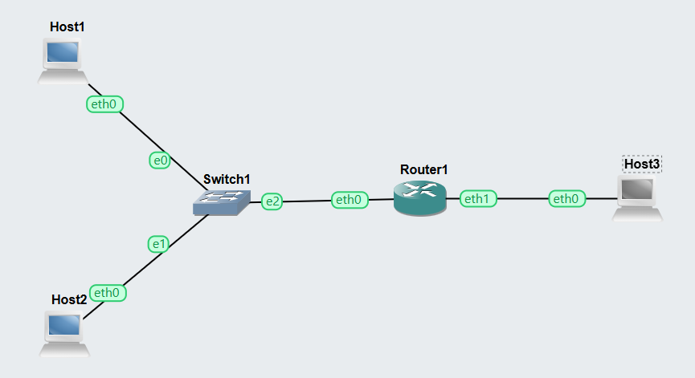

The topology demonstrates the role of Router1 as the gateway between the two networks. Traffic between hosts located on different subnets must pass through Router1.

### Host1 IP Configuration

The IP configuration of Host1 was verified using:

`ip a`

Host1 was configured with the IPv4 address:

`10.1.1.2/24`

Host1 belongs to the `10.1.1.0/24` subnet. IP forwarding was disabled because Host1 operates as an end host rather than a router.

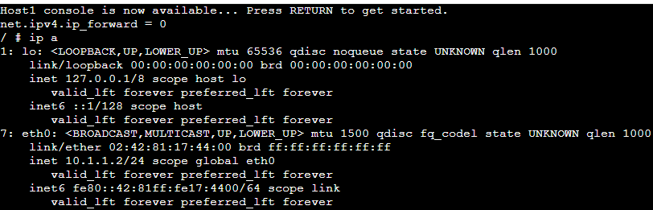

The command output confirmed that `10.1.1.2/24` was successfully assigned to the `eth0` interface of Host1.

### Cross-Subnet Connectivity Testing

After configuring the network, communication between the two different subnets was tested.

From Host1, the following command was executed:

`ping -c 3 10.1.2.2`

The destination `10.1.2.2` is Host3, which is located on the second subnet. Therefore, the packets must be forwarded through Router1 to reach Host3.

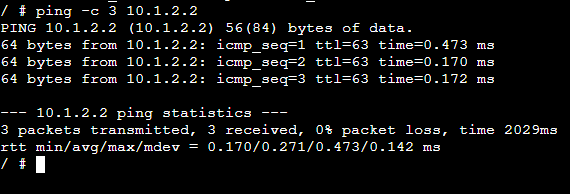
### Testing Result

The ping test was successful:

- 3 packets were transmitted.
- 3 packets were received.
- Packet loss was 0%.
- The average round-trip time (RTT) was approximately 0.271 ms.

The successful replies confirmed that Host1 could communicate with Host3 across different subnets. This demonstrated that Router1 was successfully forwarding IPv4 packets between the two networks.

### Host2 IP Configuration

The network configuration of Host2 was also verified using:

`ip a`

Host2 was configured with:

`10.1.1.3/24`

Like Host1, Host2 belongs to the `10.1.1.0/24` subnet and has IP forwarding disabled because it operates as an end host.

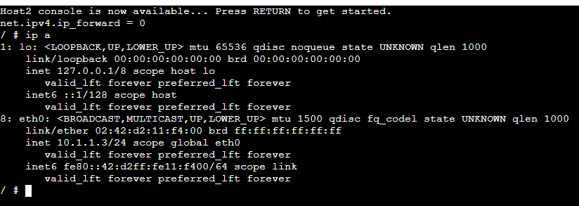

The output confirmed that the IPv4 address `10.1.1.3/24` was correctly assigned to the `eth0` interface of Host2.

### Host3 IP Configuration

Host3 was placed on the second IPv4 subnet.

Its configuration was verified using:

`ip a`

The assigned address was:

`10.1.2.2/24`

Therefore, Host3 belongs to the `10.1.2.0/24` network.

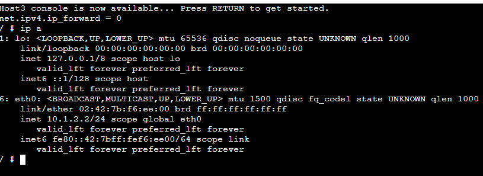

The output confirmed that `10.1.2.2/24` was successfully assigned to the `eth0` interface. Since Host3 is located on a different subnet from Host1 and Host2, communication between them requires Router1.

### Router1 Configuration and IP Forwarding

Router1 connects the two IPv4 networks and therefore requires an interface within each subnet.

The router configuration was verified using:

`ip a`

Router1 was configured with:

- `eth0` → `10.1.1.1/24`
- `eth1` → `10.1.2.1/24`

IP forwarding was enabled on Router1 so that packets received from one subnet could be forwarded to the other subnet.

The forwarding status was verified using:

`sysctl net.ipv4.ip_forward`

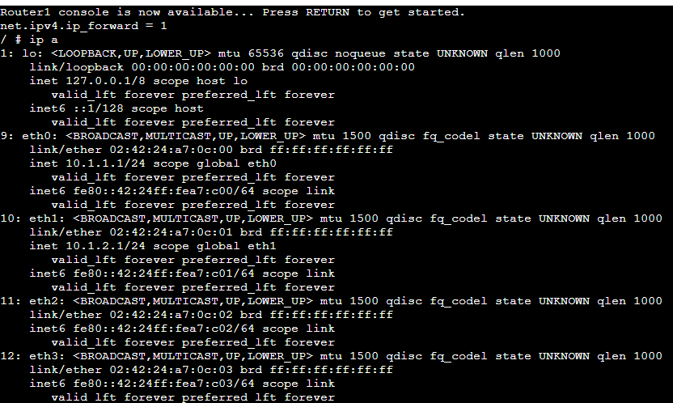

The output showed:

`net.ipv4.ip_forward = 1`

A value of `1` confirms that IPv4 forwarding is enabled on Router1.

The two configured interfaces also place Router1 directly within both the `10.1.1.0/24` and `10.1.2.0/24` networks, allowing it to operate as the gateway between them.

### Router1 Routing Table

The routing table of Router1 was examined using:

`ip route show`

A routing table determines where packets should be forwarded based on their destination network.

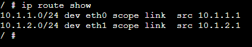

The routing table contained two directly connected routes:

- `10.1.1.0/24` through `eth0`, using `10.1.1.1`
- `10.1.2.0/24` through `eth1`, using `10.1.2.1`

These routes show that Router1 is directly connected to both IPv4 subnets. Therefore, it can determine which interface should be used when forwarding packets between the two networks.

### Task 1 Result

Task 1 was successfully completed. The IP addresses of all three hosts and both Router1 interfaces were verified, and the routing table confirmed that Router1 had direct routes to both IPv4 subnets.

IP forwarding was enabled on Router1 and disabled on the end hosts. The successful ping from Host1 (`10.1.1.2`) to Host3 (`10.1.2.2`) with 0% packet loss confirmed that Router1 was correctly forwarding packets between the `10.1.1.0/24` and `10.1.2.0/24` networks.

This activity demonstrated how host addressing, default gateways, routing tables and IP forwarding work together to provide communication between different IPv4 subnets.

### Key Concepts Learned – Task 1

- **Routing Table:** Contains routes that determine where IP packets should be forwarded.
- **Router/Gateway:** Connects different networks and forwards packets between them.
- **IP Forwarding:** Allows a Linux router to forward packets between network interfaces.
- **Default Gateway:** The router used by a host to communicate with destinations outside its local subnet.
- **Directly Connected Route:** A route to a network directly attached to one of the router's interfaces.
- **Subnet:** A logical subdivision of an IP network.
- **Ping:** A diagnostic tool used to test whether another host is reachable.
- **RTT:** Round-trip time measures how long a packet and its response take to travel between source and destination.

  
Task-2
[OSPF-Basics-Template.gns3project](./OSPF-Basics-Template.gns3project)

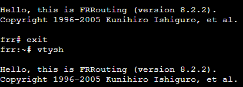
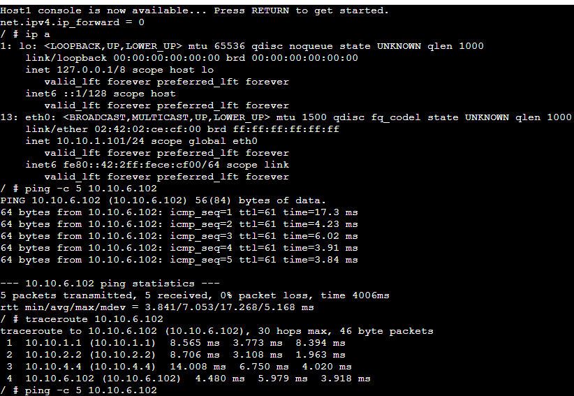
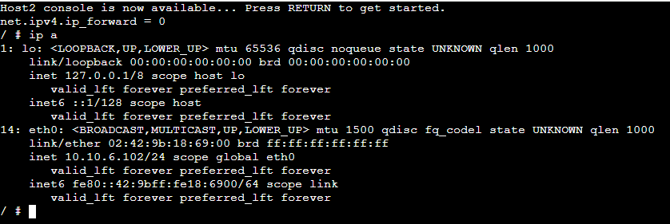
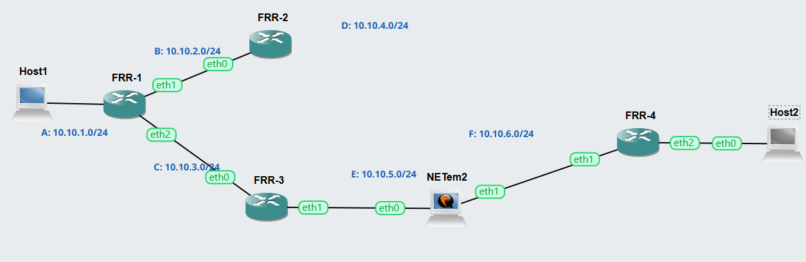
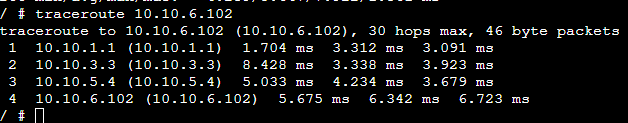
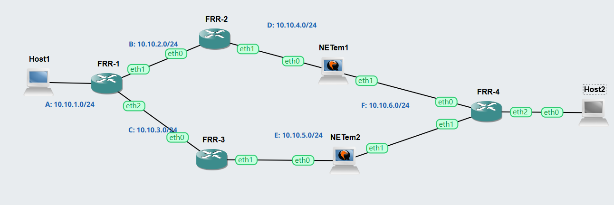
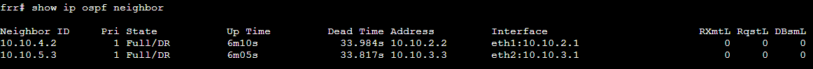
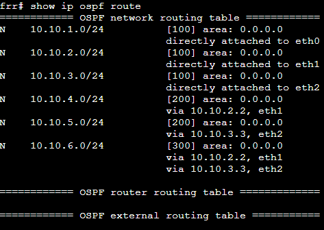
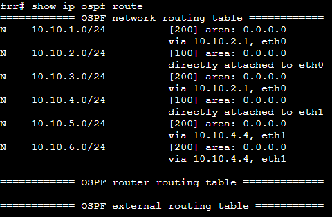
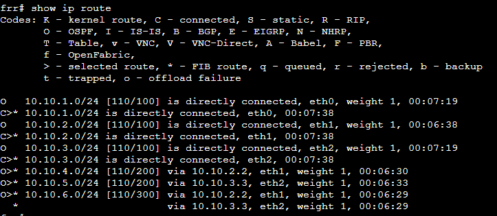
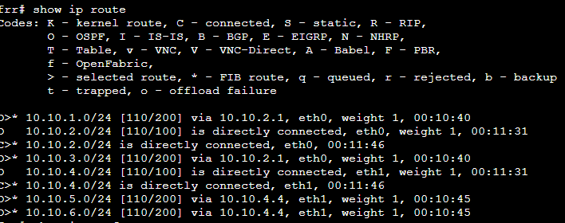
